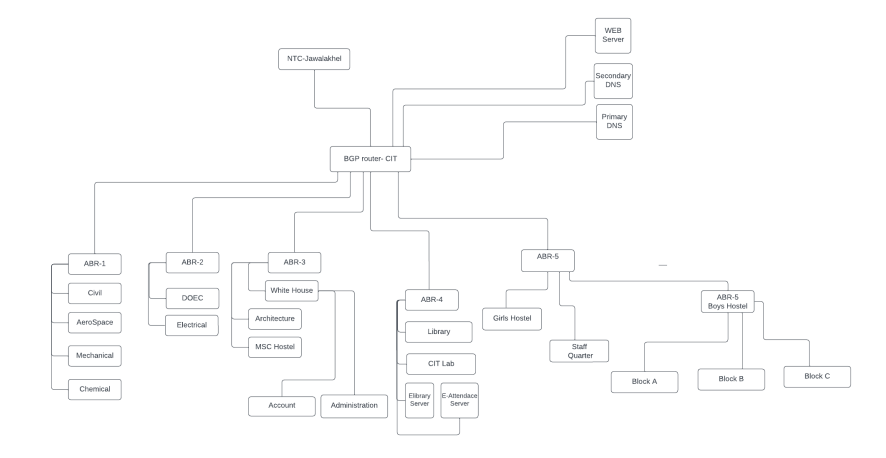
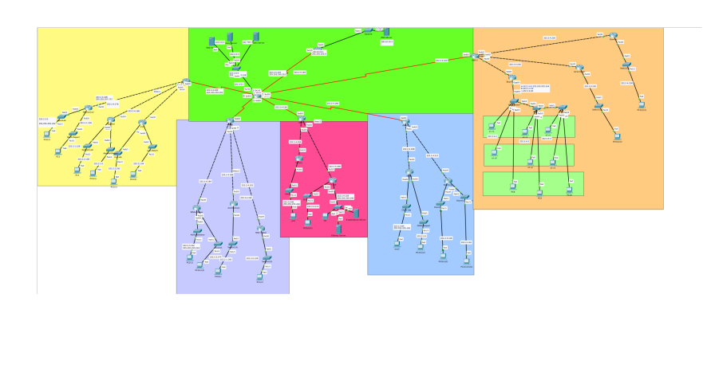
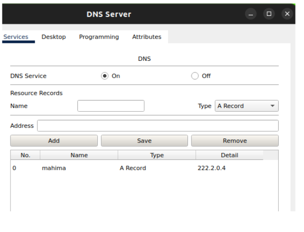
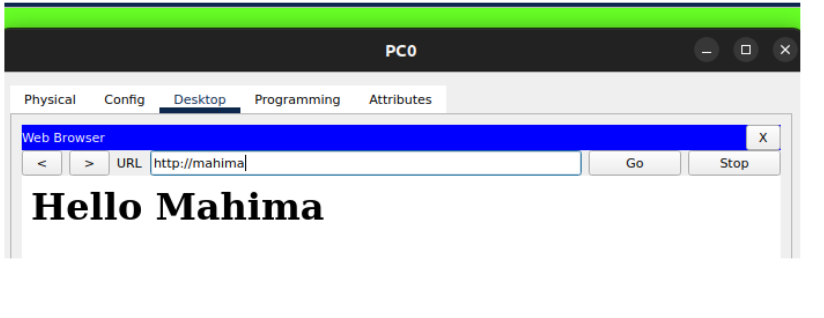
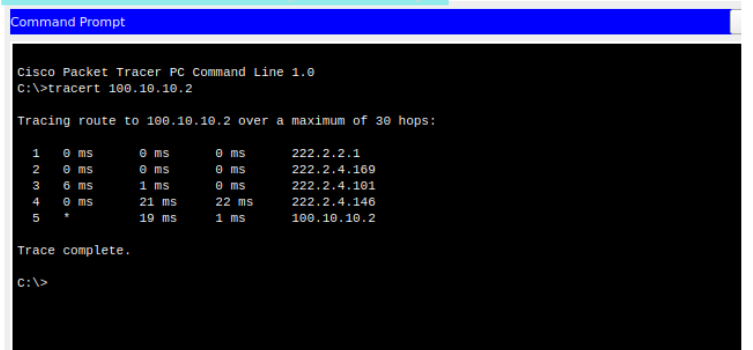
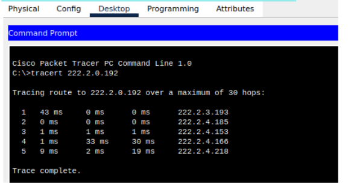
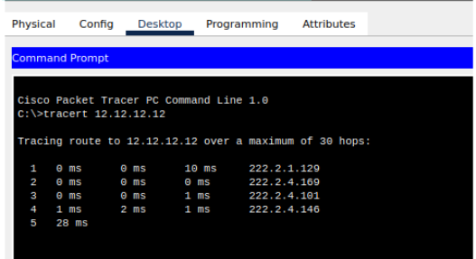
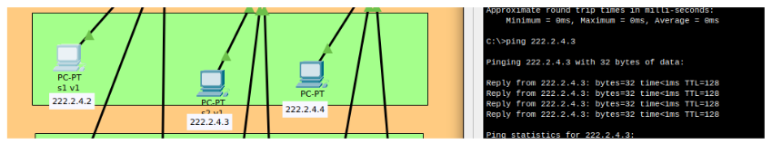

# Pulchowk Campus Network Configuration

## Overview
This project outlines the network configuration for Pulchowk Campus, designed to optimize connectivity across various departments and facilities. The network is segmented into 6 areas, 7 departments, 3 hostels and a teacher quarter, along with specialized VLANs and subnets for different units like the e-library and administrative offices.

## Network Architecture
- **Areas Covered**: 6
- **Departments**: 7
- **Hostels and Teacher Quarters**: 3
- **Special Units**: E-library, E-attendance Server, and Administration (White House)
- **VLANs**: 3 (Block A, B, C across 3 floors)
- **Servers**: Primary and Secondary DNS, Web Server
- **ISP**: NTC with 1 dedicated line

## Architecture

## Subnetting Details
The network is meticulously divided into multiple subnets to ensure efficient data routing and isolation between departments. The subnets range from /25 to /30 masks accommodating various host requirements from servers to departmental networks.

| SN | Name                | Hosts | Network Address | Slash | Mask             | Broadcast   | Wildcard     |
|----|---------------------|-------|-----------------|-------|------------------|-------------|--------------|
| 1  | CIT Server          | 100   | 222.2.0.0       | /25   | 255.255.255.128  | 222.2.0.127 | 0.0.0.127    |
| 2  | MSC Hostel          | 60    | 222.2.0.128     | /26   | 255.255.255.192  | 222.2.0.191 | 0.0.0.63     |
| 3  | Girls Hostel        | 60    | 222.2.0.192     | /26   | 255.255.255.192  | 222.2.0.255 | 0.0.0.63     |
| 4  | Applied Depart      | 50    | 222.2.1.0       | /26   | 255.255.255.192  | 222.2.1.63  | 0.0.0.63     |
| 5  | Civil Depart        | 50    | 222.2.1.64      | /26   | 255.255.255.192  | 222.2.1.127 | 0.0.0.63     |
| 6  | Mechanical Depart   | 50    | 222.2.1.128     | /26   | 255.255.255.192  | 222.2.1.191 | 0.0.0.63     |
| 7  | Architecture Depart | 50    | 222.2.1.192     | /26   | 255.255.255.192  | 222.2.1.255 | 0.0.0.63     |
| 8  | DOEC Depart         | 50    | 222.2.2.0       | /26   | 255.255.255.192  | 222.2.2.63  | 0.0.0.63     |
| 9  | Electrical Depart   | 50    | 222.2.2.64      | /26   | 255.255.255.192  | 222.2.2.127 | 0.0.0.63     |
| 10 | Applied Lab         | 50    | 222.2.2.128     | /26   | 255.255.255.192  | 222.2.2.191 | 0.0.0.63     |
| 11 | Civil Lab           | 50    | 222.2.2.192     | /26   | 255.255.255.192  | 222.2.2.255 | 0.0.0.63     |
| 12 | Mechanical Lab      | 50    | 222.2.2.0       | /26   | 255.255.255.192  | 222.2.2.63  | 0.0.0.63     |
| 13 | DOEC Lab            | 50    | 222.2.3.64      | /26   | 255.255.255.192  | 222.2.3.127 | 0.0.0.63     |
| 14 | Electrical Lab      | 50    | 222.2.3.128     | /26   | 255.255.255.192  | 222.2.3.191 | 0.0.0.63     |
| 15 | Administration      | 30    | 222.2.3.192     | /27   | 255.255.255.224  | 222.2.3.223 | 0.0.0.31     |
| 16 | Account             | 30    | 222.2.3.224     | /27   | 255.255.255.224  | 222.2.3.255 | 0.0.0.31     |
| 17 | Block A             | 20    | 222.2.4.0       | /27   | 255.255.255.224  | 222.2.4.31  | 0.0.0.31     |
| 18 | Block B             | 20    | 222.2.4.32      | /27   | 255.255.255.224  | 222.2.4.63  | 0.0.0.31     |
| 19 | Block C             | 20    | 222.2.4.64      | /27   | 255.255.255.224  | 222.2.4.95  | 0.0.0.31     |
| 20 | Library             | 10    | 222.2.4.96      | /28   | 255.255.255.240  | 222.2.4.111 | 0.0.0.15     |
| 21 | CIT-Lab             | 10    | 222.2.4.112     | /28   | 255.255.255.240  | 222.2.4.127 | 0.0.0.15     |
| 22 | E-servers           | 10    | 222.2.4.128     | /28   | 255.255.255.240  | 222.2.4.143 | 0.0.0.15     |
| 23 | CIT - NTC           | 2     | 222.2.4.144     | /30   | 255.255.255.252  | 222.2.4.147 | 0.0.0.3      |
| 24 | CIT - ABR-1         | 2     | 222.2.4.148     | /30   | 255.255.255.252  | 222.2.4.151 | 0.0.0.3      |
| 25 | CIT - ABR-2         | 2     | 222.2.4.152     | /30   | 255.255.255.252  | 222.2.4.155 | 0.0.0.3      |
| 26 | CIT - ABR-3         | 2     | 222.2.4.156     | /30   | 255.255.255.252  | 222.2.4.159 | 0.0.0.3      |
| 27 | CIT - ABR-4         | 2     | 222.2.4.160     | /30   | 255.255.255.252  | 222.2.4.163 | 0.0.0.3      |
| 28 | CIT - ABR-5         | 2     | 222.2.4.164     | /30   | 255.255.255.252  | 222.2.4.167 | 0.0.0.3      |
| 29 | ABR1-Mechanical     | 2     | 222.2.4.168     | /30   | 255.255.255.252  | 222.2.4.171 | 0.0.0.3      |
| 30 | ABR1-Applied        | 2     | 222.2.4.176     | /30   | 255.255.255.252  | 222.2.4.179 | 0.0.0.3      |
| 31 | ABR1-Civil          | 2     | 222.2.4.180     | /30   | 255.255.255.252  | 222.2.4.183 | 0.0.0.3      |
| 32 | ABR2-White House    | 2     | 222.2.4.184     | /30   | 255.255.255.252  | 222.2.4.187 | 0.0.0.3      |
| 33 | ABR2-Architecture   | 2     | 222.2.4.188     | /30   | 255.255.255.252  | 222.2.4.191 | 0.0.0.3      |
| 34 | ABR2 -Msc Hostel    | 2     | 222.2.4.192     | /30   | 255.255.255.252  | 222.2.4.195 | 0.0.0.3      |
| 35 | ABR3-Library        | 2     | 222.2.4.196     | /30   | 255.255.255.252  | 222.2.4.199 | 0.0.0.3      |
| 36 | ABR3-CIT Lab        | 2     | 222.2.4.200     | /30   | 255.255.255.252  | 222.2.4.203 | 0.0.0.3      |
| 37 | ABR3-Library        | 2     | 222.2.4.204     | /30   | 255.255.255.252  | 222.2.4.207 | 0.0.0.3      |
| 38 | ABR4-DOEC           | 2     | 222.2.4.208     | /30   | 255.255.255.252  | 222.2.4.211 | 0.0.0.3      |
| 39 | ABR4-Electrical     | 2     | 222.2.4.212     | /30   | 255.255.255.252  | 222.2.4.215 | 0.0.0.3      |
| 40 | ABR5-Girls Hostel   | 2     | 222.2.4.216     | /30   | 255.255.255.252  | 222.2.4.219 | 0.0.0.3      |
| 41 | ABR5-Quarter        | 2     | 222.2.4.220     | /30   | 255.255.255.252  | 222.2.4.223 | 0.0.0.3      |
| 42 | ABR5-Boys Hostel    | 2     | 222.2.4.224     | /30   | 255.255.255.252  | 222.2.4.227 | 0.0.0.3      |
| 43 | Quarter             | 2     | 222.2.4.228     | /30   | 255.255.255.252  | 222.2.1.231 | 0.0.0.3      |

## DNS Server Configuration

## Route to ISP from mechanical Department (sample)

## Inter Area communication ( Civil Depart to Girls Hostel)

## All random networks forwarded to ISP

## VLAN

## Key Features
- **Subnetting Implementation**: Provides detailed host distribution across different network segments.
- **DNS and Server Configurations**: Ensures robust internet service and intranet reliability.
- **Router and VLAN Configuration**: Facilitates effective traffic management and security within the campus network.

## Configuration Highlights
- **OSPF Routing**: Implemented for seamless internal connectivity.
- **Traffic Forwarding**: Configured to handle traffic to and from the upstream service provider efficiently.
- **Security Measures**: Includes detailed access control and password protection strategies to secure network access and data integrity.

## Conclusion
The network configuration project for Pulchowk Campus has been successfully completed, adhering to the outlined guidelines. This configuration supports robust connectivity and is designed to be scalable to accommodate future expansions or technological upgrades.

---

### Instructions for Network Updates
To update the network settings or expand the network configuration:
1. Refer to the subnetting section for details on existing configurations.
2. Follow the VLAN setup instructions to modify or add new VLANs.
3. Adjust OSPF settings as necessary to improve routing efficiencies or to accommodate network changes.

